<div align="center">

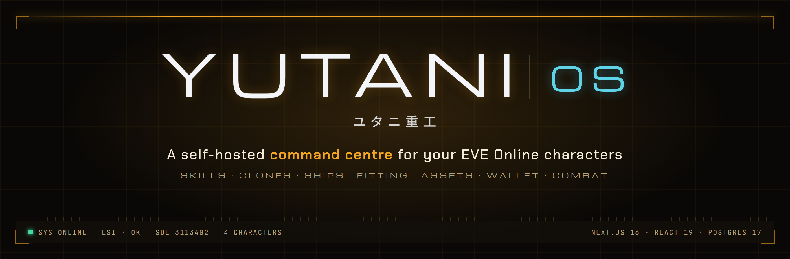

<br>

**A self-hosted command centre for your EVE Online characters: skills, clones, ships, fitting, assets, wallet and combat, behind EVE SSO, in an amber-phosphor console.**

One Next.js app, one sync worker, one Postgres. The pages never call ESI. The worker keeps the database fresh and the pages read from it, so every screen is instant and nothing you click can hit a rate limit.

[](https://nextjs.org/)
[](https://react.dev/)
[](https://www.typescriptlang.org/)
[](https://www.postgresql.org/)
[](https://mantine.dev/)
[](https://developers.eveonline.com/)
[](https://developers.eveonline.com/api-explorer)
[](tests/)
[](deploy/)

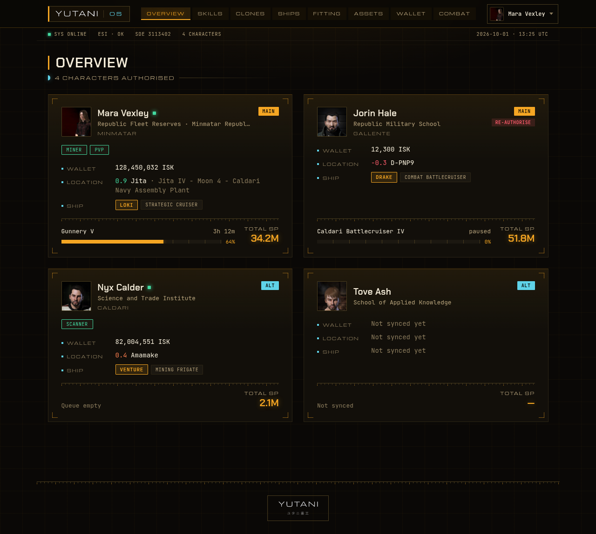

*The Overview. Every authorised character on one screen: who is online, where they are, what they fly, what is training and for how long.*

</div>

---

## ✨ What it does

Yutani OS signs your characters in with EVE SSO, syncs them in the background and gives you nine screens:

| | | |
| --- | --- | --- |
| 🏠 | **Overview** | Every character, two-up: online dot, corp and alliance, race, main/alt, tags, wallet, sec-coloured location, hull, the skill in training with real SP progress, total SP. |
| 🎓 | **Skills** | Summary and attributes, a four-character **training overview**, the queue with a live countdown, every trained skill in framed groups, and your **skill plans**. |
| 🧬 | **Clones** | Home station, active implants with their bonuses, jump clones. |
| 🚀 | **Ships** | Every fitted ship you own and every saved fit, as cards with DPS, EHP, speed, capacitor, CPU and powergrid gauges, missing skills and Jita value. |
| 🛠️ | **Fitting** | A full **fitting designer** with a Pyfa-style dogma engine running in the browser. EFT import and export. |
| 📦 | **Assets** | Every location as a tree: ships with their fitted modules by slot, containers, blueprints, stacks, volumes. |
| 💰 | **Wallet** | Balance, journal and transactions, colour-coded. |
| ⚔️ | **Combat** | A private killboard: stats tiles, a twelve-month activity strip, top ships and systems, and every killmail back to the start of your history via zKillboard. |
| ⚙️ | **Settings** | Accounts, characters, tags, the static-data build, and a sync-status table that tells you exactly what ran, when, and why it failed. |

Everything sits behind one session cookie. Only allow-listed characters can sign in.

---

## 🚀 Built on the current stack

| | Technology | Why it matters |
| --- | --- | --- |
| ⚛️ | **Next.js 16, React 19** | App router, server components for every page, API routes for the editors. One image serves the web app and the worker. |
| 🟦 | **TypeScript, strict, end to end** | The ESI client is typed from CCP's OpenAPI document, pinned to a compatibility date, and regenerated with one command. |
| 🐘 | **PostgreSQL 17** | One schema file, idempotent migrations. The SDE lives in our own `sde_*` tables, so every page is a local query. |
| 🔐 | **EVE SSO with PKCE** | OAuth2 authorization code + PKCE, JWTs verified against CCP's JWKS, refresh tokens encrypted at rest, a character allow-list, and twelve read-only ESI scopes. |
| 📡 | **A careful ESI client** | ETag caching in Postgres, per-route rate-limit buckets, an error-limit floor, and a circuit breaker that stops calling during a Tranquility outage instead of getting the app 420'd. |
| 🧮 | **A pure dogma engine** | Modelled on Pyfa: fit tree, SDE effects with modifier info, stacking penalties, cap stability, DPS, volley, EHP, mobility and targeting. The same code runs on the server and in the browser. |
| 🗂️ | **CCP's Static Data Export** | The worker streams the ~95 MB JSON Lines archive to disk, imports it, and re-checks the published build every six hours. |
| 🔁 | **A twelve-job sync worker** | Four global jobs and eight per-character jobs, staggered, every run recorded in `sync_runs` and shown on Settings. |
| 🎨 | **Mantine 9 + one hand-written stylesheet** | Tokens only, dark only, no utility framework. Michroma, Chakra Petch and JetBrains Mono. |
| 🐳 | **Docker Compose, Traefik, Ansible** | Postgres, app and worker behind Traefik with Cloudflare DNS-challenge TLS. One playbook provisions a fresh VM. |

---

## 🏠 Overview

- 👥 **Every character, grouped by account.** Main and alt pills, tags you define, a re-authorise badge the moment a token stops working.
- 🟢 **Live where it matters.** Online dot, current system with its security status, the station or structure, the hull and its class.
- 📈 **Training progress by SP, not by the clock.** The bar measures how far through the level the character is, so it is right even after a queue was paused.
- 📱 **Works on a phone.** Under 760 px the top nav becomes a bottom bar and the cards go single-column.

<div align="center">
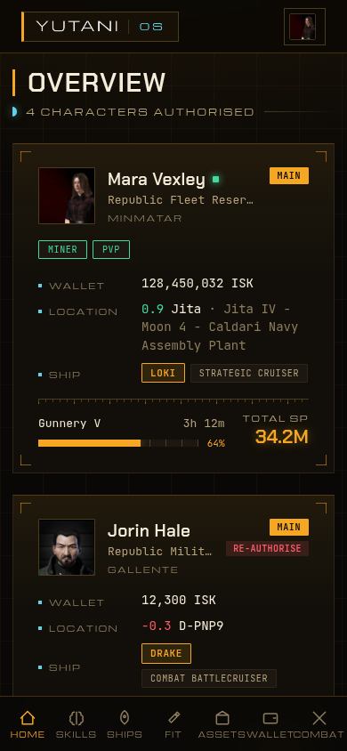
</div>

---

## 🎓 Skills and the planner

<div align="center">
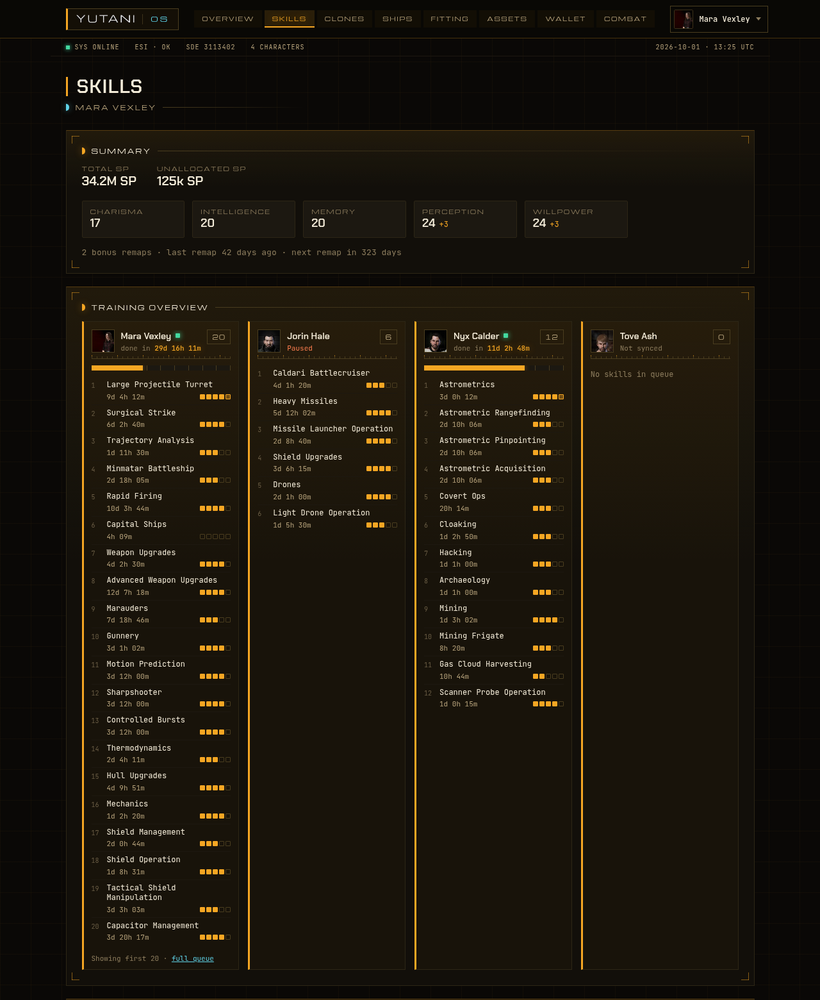

*Summary, attributes and remaps, then the Training overview: every character's queue side by side, with a countdown to the end of each.*
</div>

- 📊 **Summary and attributes.** Total and unallocated SP, the five attributes with implant bonuses, bonus remaps and when the next one is available.
- 🧭 **Training overview.** One column per character, up to twenty queue entries each, the head skill's progress bar and a "done in" countdown. Paused and unsynced characters say so.
- ⏱️ **The queue, live.** Time remaining per entry, a ticking countdown above the table, and it advances past entries ESI still lists after they finished.
- 🗂️ **Trained skills in framed groups**, with level boxes (trained, active, training) and the SDE description on hover.

<div align="center">
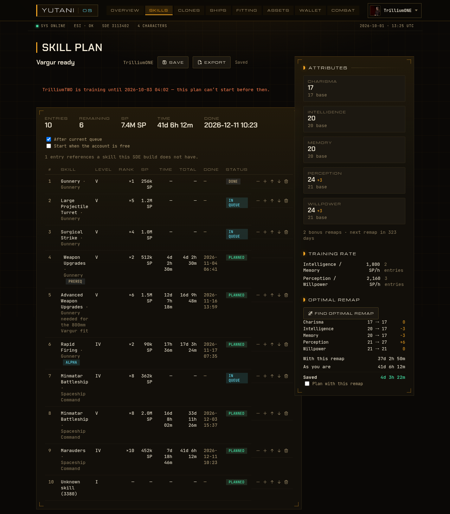

*A plan. Entries, SP, time and finish date up top. Done, in-queue and planned rows with prerequisite and Alpha badges. The optimal remap on the right.*
</div>

- 📝 **EVEMon-style plans.** Up to 500 entries, prerequisites expanded automatically, Alpha-trainable levels badged, and a warning when another character on the account is already training.
- 🧠 **Optimal remap.** Brute-forces all 2,885 legal attribute distributions and tells you the fastest one and how much it saves.
- 📥 **Import and export.** Paste a plan from EVEMon, or start from one of CCP's forty certified career plans. Export as EVEMon text or in the in-game skill-plan format.
- 🔁 **Same maths everywhere.** The training timeline is a pure, isomorphic library. The server computes it for the page, the editor recomputes it on every keystroke, and the two cannot disagree.

---

## 🚀 Ships and fit sheets

<div align="center">
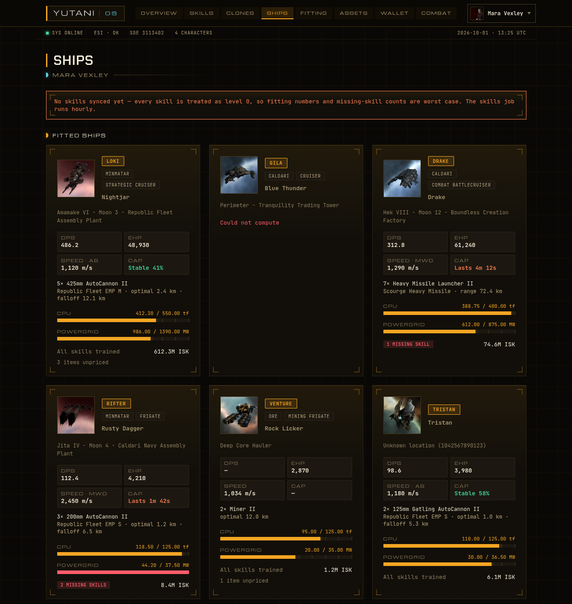

*Fitted ships, straight from your assets. Each card is computed against the character's actual skills.*
</div>

- 🛰️ **Fitted ships and saved fits** are both cards: render, hull, race and class pills, location, DPS, EHP, speed and capacitor, CPU and powergrid gauges, missing skills and estimated value.
- 🎯 **Honest numbers.** Until a character's skills are synced the page says so and treats every skill as level 0, so the worst case is what you see.

<div align="center">
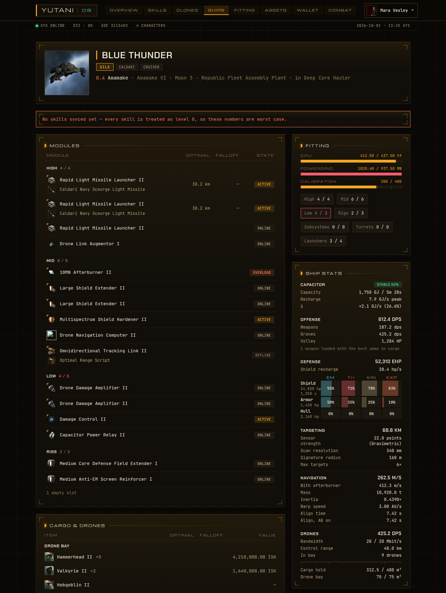

*A fit sheet. The Ship stats card mirrors the in-game fitting window. Hover a value to see which skills and modules changed it, and which were stacking-penalised.*
</div>

- 🔍 **Affected by.** Every module and stat can show the modifiers that produced it, with the stacking penalty called out.
- 🧾 **Problems and missing skills** in their own cards: slot overflow, powergrid over, a skill one level short, a drone bay too small.
- 💎 **Value broken down** into hull, modules and rigs, charges, drones and cargo, priced from Jita, with the unpriced items counted.

---

## 🛠️ The fitting designer

<div align="center">
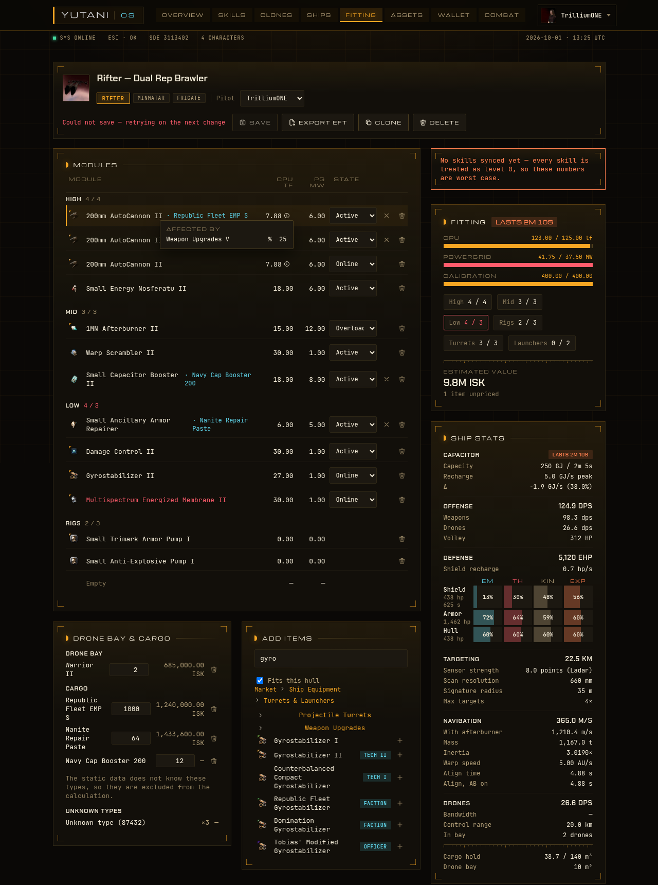

*The designer. Modules with states and charges on the left, live fitting totals and Ship stats on the right, the item browser filtered to what fits this hull.*
</div>

- ⚡ **The dogma engine runs in the browser.** One cached request fetches the attribute and effect tables once a day, types are fetched on demand, and every change recomputes instantly.
- 🧰 **Real module states.** Active, overloaded, online, offline and passive, with charges loaded and ammo assumed from cargo for the DPS number.
- 🔎 **An item browser that knows your hull.** Tick "fits this hull" and the market tree only shows what will fit, with Tech II, Faction and Officer badges.
- 📋 **EFT in, EFT out.** Import a fit from text, export one, clone it, or build one from an asset, a saved fitting or a killmail.
- 💰 **Priced as you browse.** Prices come from Jita aggregates. A module nobody has priced yet is priced synchronously the first time you see it.
- 🔒 **Yours.** Fits live in this database and are never written back to ESI. The write-fittings scope is not even requested.

---

## ⚔️ Combat

<div align="center">
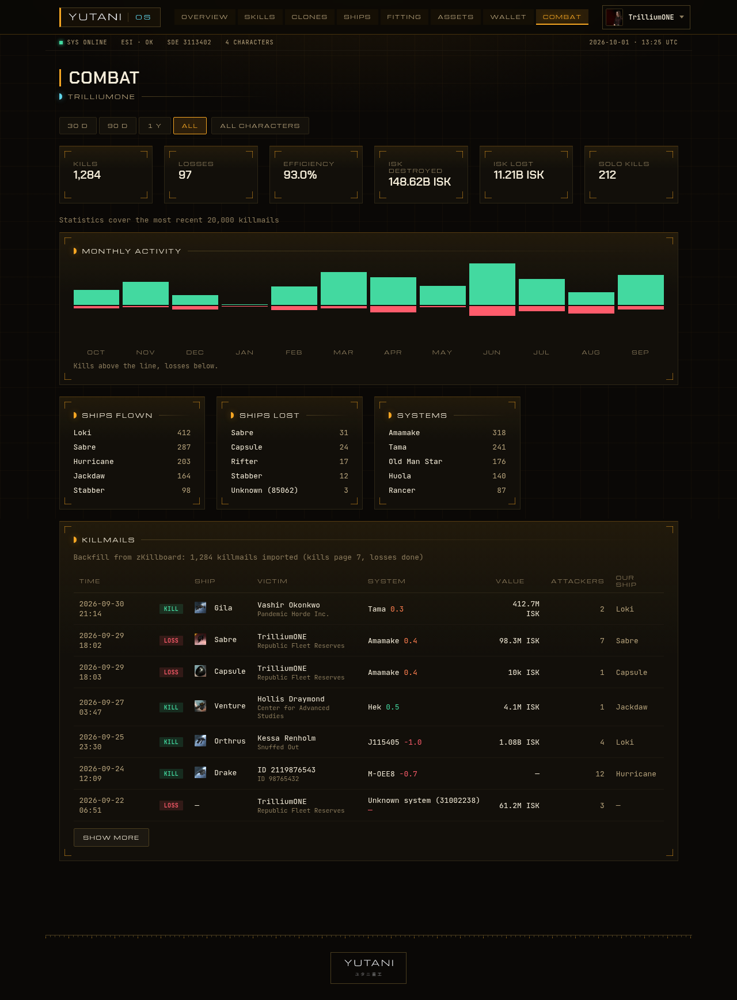

*The killboard. Kills above the line, losses below. Statistics cover the most recent 20,000 killmails per character.*
</div>

- 📅 **30 days, 90 days, a year or everything**, for one character or all of them.
- 🧮 **Kills, losses, efficiency, ISK destroyed, ISK lost, solo kills**, a twelve-month strip, and the ships and systems you fight in most.
- 🕰️ **Your whole history.** ESI only keeps 90 days of killmails, so a backfill job walks zKillboard, politely, one request every two seconds, up to 20,000 kills and 20,000 losses per character.
- 💸 **Every killmail is valued** from the same market table the Ships pages use, with zKillboard's total shown when it has one.

<div align="center">
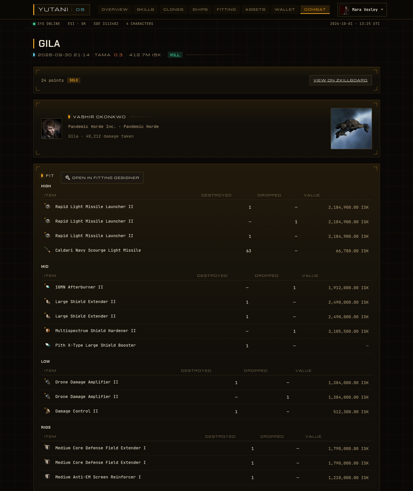

*One killmail. Victim, fit with destroyed and dropped columns, attackers, and a button that opens the victim's fit in the designer.*
</div>

---

## 📦 Assets, 💰 wallet and 🧬 clones

<div align="center">
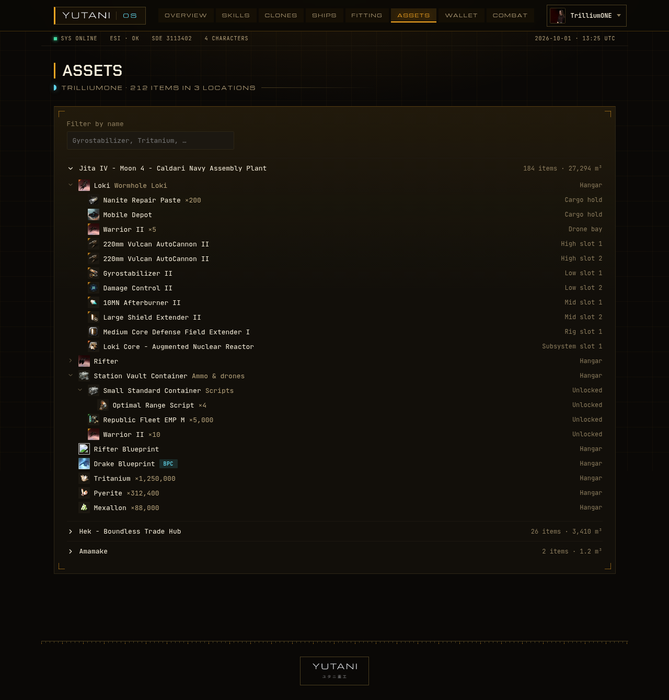

*Assets as a tree. A ship opens into its fitted modules by slot; a container opens into what is inside it.*
</div>

- 🌳 **Locations, then ships and containers, then items.** Counts and cubic metres per location, type icons on every row, blueprint originals and copies badged, a name filter.
- 🏗️ **Player structures named.** Citadels the character can dock at are resolved through the structures scope.

<div align="center">
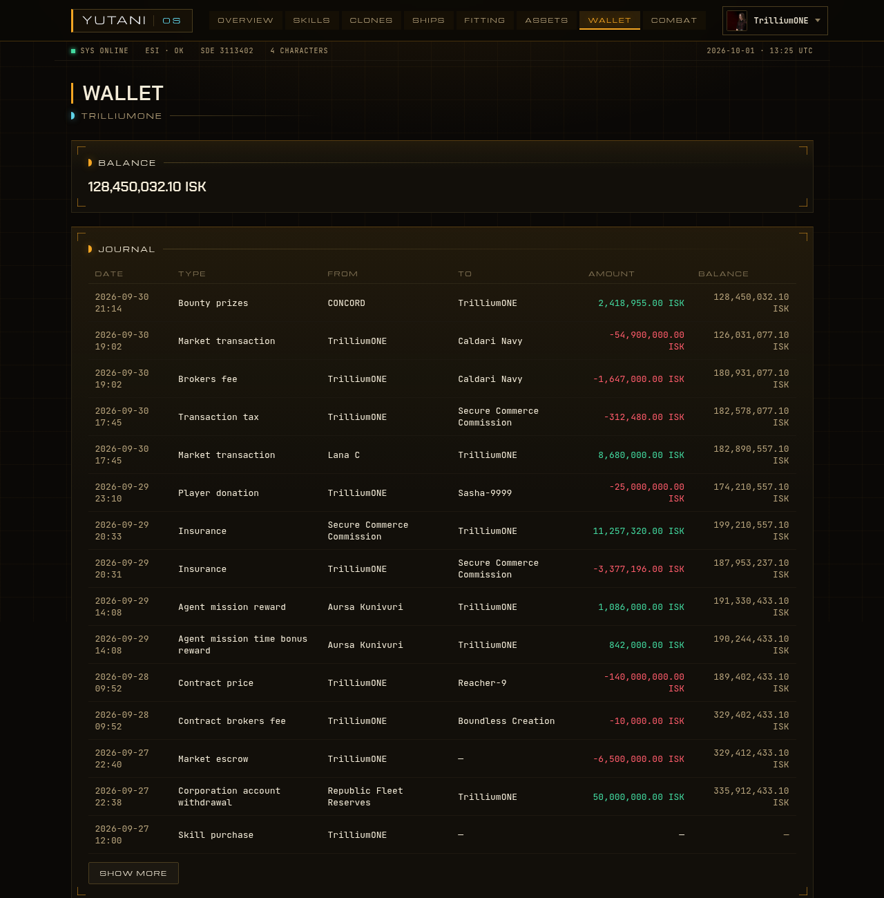
</div>

- 💰 **Wallet.** Balance, the journal with running balance, and transactions, with income green and spend red.
- 🧬 **Clones.** Home station, active implants and the attribute bonuses they give, every jump clone and where it is.

---

## ⚙️ Settings and the sync table

<div align="center">
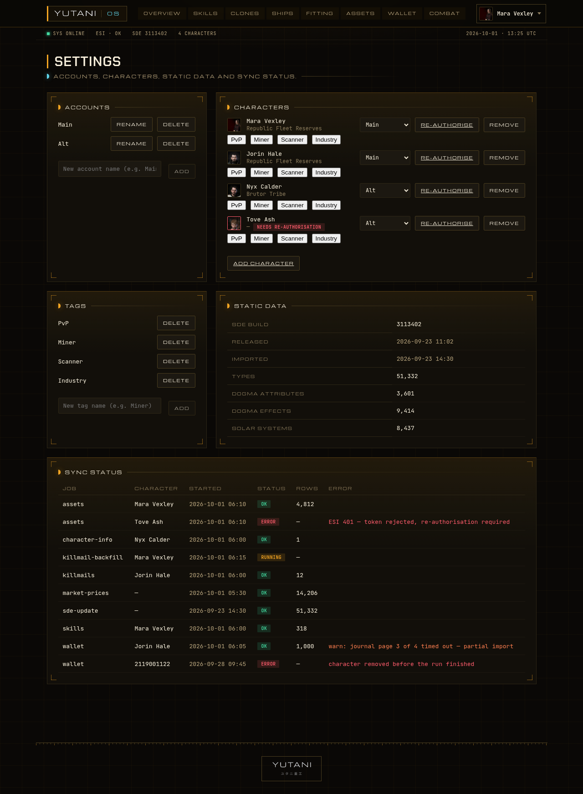

*Accounts, characters, tags, the SDE build, and a sync table that names the job, the character, the row count and the error.*
</div>

- 👤 **Accounts and characters.** Group characters under accounts, mark main and alt, re-authorise one when its token is rejected, remove one cleanly.
- 🏷️ **Tags** you define, shown as pills on the Overview.
- 🗄️ **Static data.** The imported SDE build, when CCP released it, when it was imported, and the table counts.
- 🩺 **Sync status.** Every job's latest run per character with status, rows and the message. Partial imports show as amber warnings, not silent gaps.

---

## 🔒 Who gets in

<div align="center">
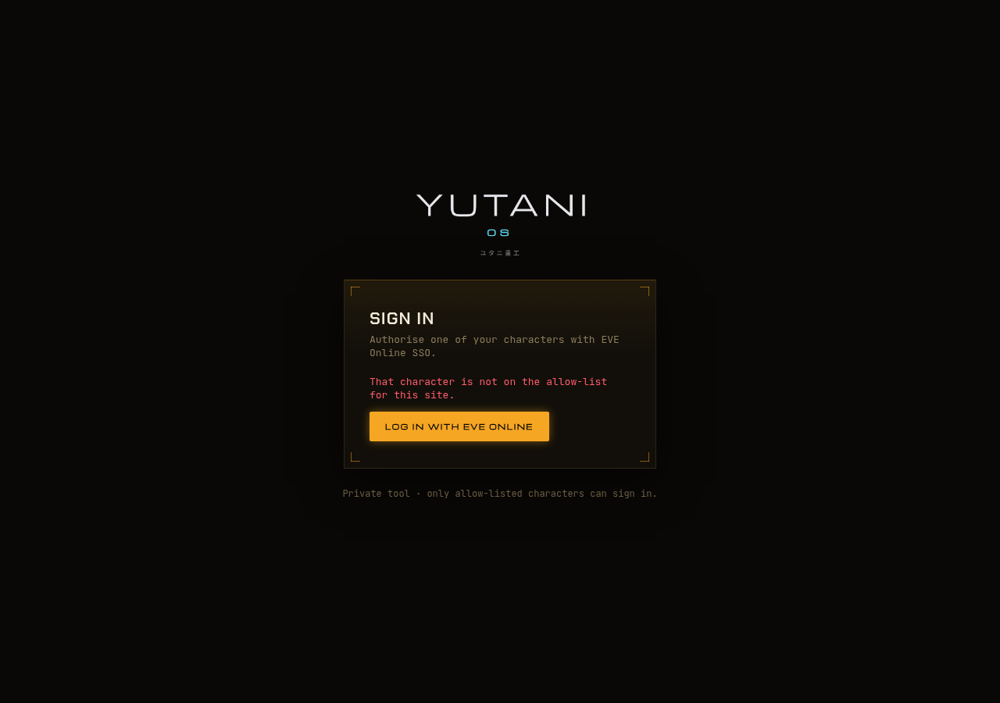
</div>

- 🪪 **EVE SSO only.** Authorization code with PKCE, the token's JWT verified against CCP's JWKS, issuer and audience checked.
- 📜 **A character allow-list.** A character that is not on it is turned away and nothing is stored.
- 🔐 **Refresh tokens are encrypted at rest** with the session secret. Access tokens are refreshed by the worker as needed.
- 🚪 **One guard for every path.** The proxy lets through the login page, the health check, the SSO callback and the brand images. Everything else needs the session cookie.

---

## 🛠️ Under the hood

- **Pages read Postgres, never ESI.** The worker owns every outbound call. A page that cannot reach the database still renders its shell and says so.
- **Twelve jobs.** Global: `sde-update` (6 h), `market-prices` (1 h), `killmail-backfill` (15 min), `killmail-values` (1 h). Per character: `character-info` and `clones` and `fittings` (6 h), `skills`, `assets`, `wallet` and `killmails` (1 h), `location` (15 min). Character jobs are staggered so a tick never fans out all at once. A failed run retries after ten minutes.
- **The ESI client** remembers which rate-limit bucket each route template belongs to, caches by ETag in Postgres, backs off when the error-limit header gets low, and opens a one-minute breaker after any 502, 503 or 504.
- **Market prices** come from two sources: CCP's reference prices for every type, and Fuzzwork's Jita aggregates for the types of interest, which is everything you own, everything in a fit, everything traded in the last 30 days and everything on a recent killmail. Fuzzwork has no SLA, so a failure degrades to the reference prices and shows as a warning.
- **The dogma engine** is a pure library under `src/lib/dogma`. Fit tree, SDE effects with modifier info, stacking penalties, validation, performance. The server loads it from Postgres; the browser gets the same tables as cached JSON.
- **Killmails are immutable.** A `(killmail_id, killmail_hash)` pair is stored once and never re-fetched; only its value columns are ever updated.
- **Design notes for every phase** live in [`docs/superpowers/specs/`](docs/superpowers/specs/) and the plans that built them in [`docs/superpowers/plans/`](docs/superpowers/plans/). The research behind the SDE format, the ESI endpoints, the dogma engine and the skill planner is in [`docs/research/`](docs/research/).

---

## 📦 Install

### Requirements

- **Node 24** and npm.
- **PostgreSQL 17**, or Docker for the bundled dev database.
- An **EVE developer application** from [developers.eveonline.com](https://developers.eveonline.com) with the callback `http://localhost:3000/auth/callback` and the twelve scopes listed in `src/lib/auth/sso.ts`.
- The **character IDs** you want to allow in.

### Run it locally

```bash
git clone https://github.com/dc9090-web/yutani-os.git
cd yutani-os
npm ci

cp .env.example .env          # fill in the SSO app, the allow-list, a session secret and the database URL
docker compose -f compose.dev.yml up -d     # Postgres 17 on 127.0.0.1:5432, user/password/db all "eve"
npm run migrate               # applies db/schema.sql and the SDE tables

npm run dev                   # the app on http://localhost:3000
npm run worker                # in a second terminal: syncs characters, imports the SDE, pulls prices
```

The first worker tick downloads and imports the SDE, which takes a few minutes. Settings shows "Not imported yet" until it is done. Then sign in with each character you allow-listed and the per-character jobs begin.

### Configuration

| Variable | What it is |
| --- | --- |
| `EVE_CLIENT_ID`, `EVE_CLIENT_SECRET`, `EVE_CALLBACK_URL` | Your EVE SSO application. |
| `ALLOWED_CHARACTER_IDS` | Comma-separated character IDs that may sign in. |
| `OVERVIEW_CHARACTER_IDS` | Which of them the Overview and the Training overview show. Empty means all. |
| `ESI_COMPATIBILITY_DATE` | A date from ESI's published list. Pinned in five places; bump them together and re-run `npm run esi:types`. |
| `ESI_USER_AGENT` | A descriptive user agent with a contact, as CCP asks. |
| `SESSION_SECRET` | Signs the session cookie and encrypts refresh tokens. `openssl rand -hex 32`. |
| `DATABASE_URL`, `POSTGRES_PASSWORD` | Where Postgres is. |

---

## ⌨️ Scripts

| Command | What it does |
| --- | --- |
| `npm run dev` / `build` / `start` | The Next.js app. |
| `npm run worker` | The sync worker. |
| `npm run migrate` | Apply the schema, idempotently. |
| `npm run sde:import` | Download and import the current SDE by hand, without waiting for the schedule. |
| `npm run esi:types` | Regenerate the typed ESI client from CCP's OpenAPI document for the pinned compatibility date. |
| `npm run sde:fixture` / `dogma:fixture` / `skills:fixture` | Rebuild the test fixtures from a real SDE. |
| `npm test` | The vitest suite. `npm run test:watch` to keep it running. |
| `npm run typecheck` | `tsc --noEmit`. |

---

## 🤖 Deploying

`deploy/` has the production Compose file and an Ansible playbook with four roles: `common`, `docker`, `traefik` and `eve`. Traefik terminates TLS with a Cloudflare DNS challenge and the app is restricted to your LAN and tailnet. The whole stack is three containers: Postgres, the app and the worker, built from one image.

```bash
cd deploy/ansible
ansible-galaxy collection install -r requirements.yml
cp vars/secrets.yml.example vars/secrets.yml      # fill it in; the playbook refuses CHANGEME
ansible-playbook site.yml                          # first deploy
ansible-playbook site.yml --tags eve               # redeploy app changes
```

See [deploy/README.md](deploy/README.md) for the SDE, market, fitting, planner and combat operational notes.

---

## 🎨 The Yutani OS design

Yutani OS is the sister project of [Yutani](https://github.com/dc9090-web/yutani), the EVE multiboxing tool for COSMIC, and wears the same house style: a MU/TH/UR console in amber phosphor on warm black.

- 🎛️ **Tokens only, dark only.** Every colour is a custom property on `:root`. Status colours never change meaning: green is ok, kill and high-sec; red is error, loss and null-sec; amber is active and warning; cyan is charges, meta and links.
- 🔤 **Three families.** Michroma for labels, nav and buttons. Chakra Petch for titles, names and values. JetBrains Mono for body copy and every table.
- 🪟 **Glass panels with corner brackets**, tick rulers on card feet, a grid field behind the page, and a system strip under the header with sync state, ESI, SDE build, character count and the UTC clock.
- 📐 **One hand-written stylesheet.** No preprocessor, no CSS modules, no utility framework. Mantine draws only the character menu and the Settings forms.
- 🔁 **Designed in the open.** [`docs/design-package/`](docs/design-package/) holds every screen as self-contained HTML transcribed from the real JSX, with the real stylesheet inlined, so the whole UI can be restyled in a design tool and diffed back. [`CHANGES.md`](docs/design-package/CHANGES.md) records the Yutani OS iteration.

---

## 🧪 Tests

```bash
npm test
```

1,166 vitest tests across 132 files cover the SSO flow, the ESI client's rate limiting and breaker, the SDE importer, the dogma engine against real fits, EFT parsing, the skill timeline and remap optimiser, the killmail pipeline and the React components. The `tests/db` suite needs a Postgres on port 5432; `compose.dev.yml` provides one.

---

## 📜 Licence

No open-source licence has been applied yet, so all rights are reserved until one is chosen.

EVE Online and all related marks are the property of CCP hf. Yutani OS is a fan-made tool and is not affiliated with or endorsed by CCP.
